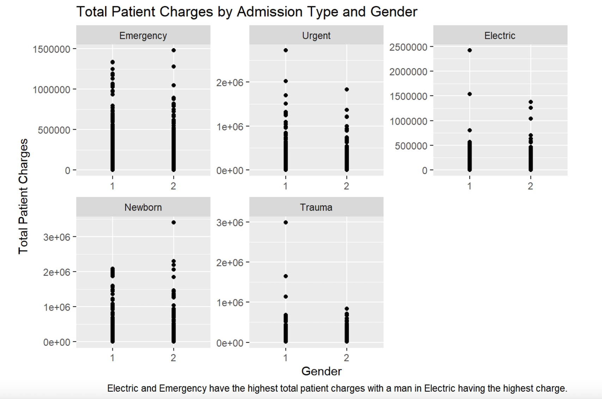
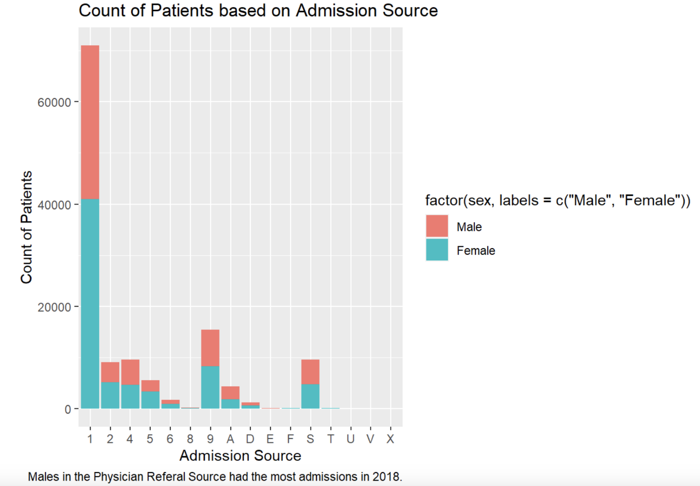
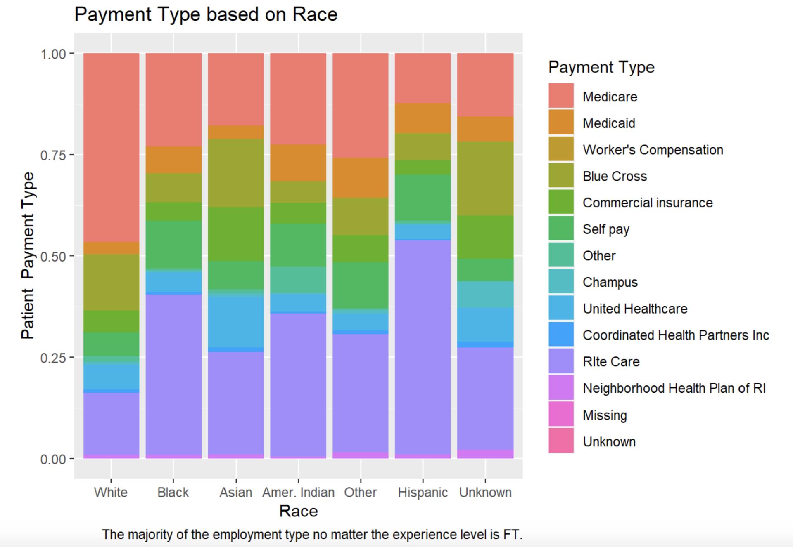
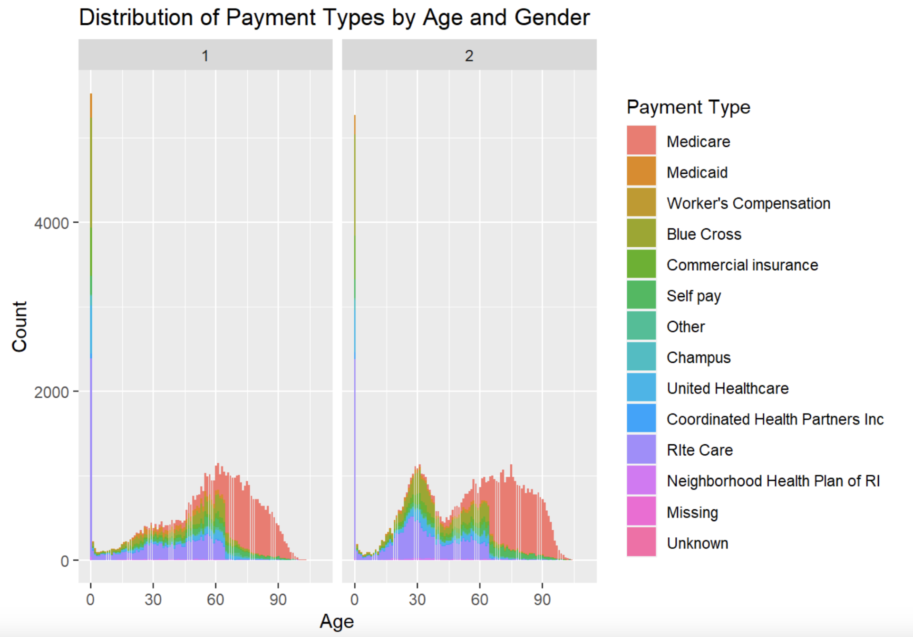

---
title: "Midterm Presentation"
output:
  xaringan::moon_reader:
    lib_dir: libs
    nature:
      highlightStyle: github
      highlightLines: true
      countIncrementalSlides: false
   
---

class: inverse, center, middle

# Data Visualizations

---
class: center


---
class: center


---

class: center


---
class: center


---
class: center



---
class: center


---

class: center



---
class: center



---
class: inverse, center, middle

# Animated Plot

---

```{r}
library(gganimate)
library(ggplot2)
library(tidyverse)
library(knitr)
custom_admtype_labels <- c(
  "1" = "Emergency",
  "2" = "Urgent",
  "3" = "Electric",
  "4" = "Newborn",
  "5" = "Trauma")
df2 %>% 
  ggplot(aes(x = tot, y = age, color = sex)) +
  geom_point() +
  transition_states(admtype) +
  labs(
    title = 'Admission Type: {closest_state}',
    x = "Total Charges",
    y = "Age",
    color = "Gender"
  ) +
  scale_x_discrete(name = "Admission Type", labels = custom_admtype_labels) +  
  scale_color_discrete(name = "Gender", labels = c("1" = "Male", "2" = "Female")) + 
  scale_x_continuous(name = "Total Charges") +  
  scale_y_continuous(name = "Age") +  
  guides(color = guide_legend(title = "Gender"))  
```
---


- Rsudio is an **editor**


---

- Rsudio makes it easier to write R codes. 


---


- Do we need Rstudio to run R? 
--
**No!**

--

- Do we need R to code in Rstudio? 
--
**Yes!**

---
class: center

# Rstudio Overview


---
# Workflow

- Write R in Rstudio Environment

- Showcase the result by Rmarkdown

- Publish the result via Github

---
class: inverse, middle, center

# Your Turn

Setup your workflow

---
class: inverse

# Assignment 1: Setting it up

- Download and Install R

- Download and Install Rstudio

- Download and Install Git at

- Download and Install Github Desktop

- While waiting for the installation, sign up for an account at Github: https://github.com/
---

class: inverse

# Create a workflow and publish your first assignment